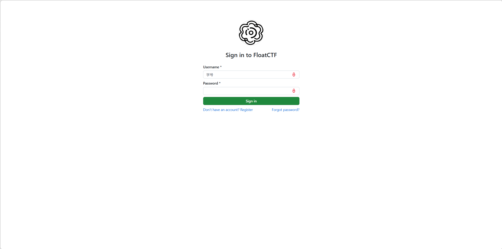
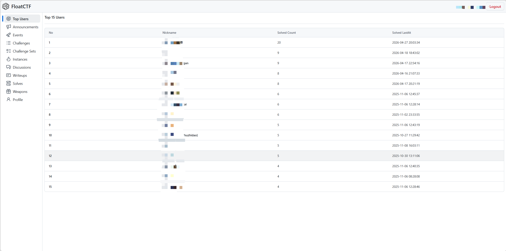
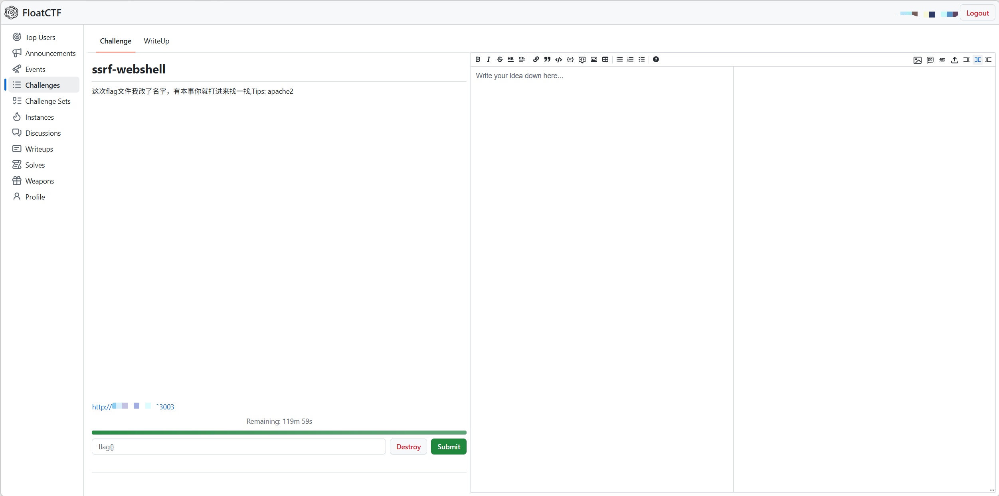
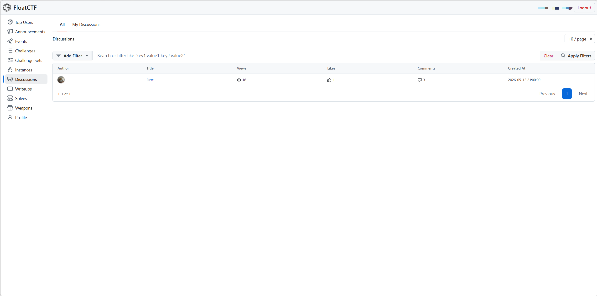
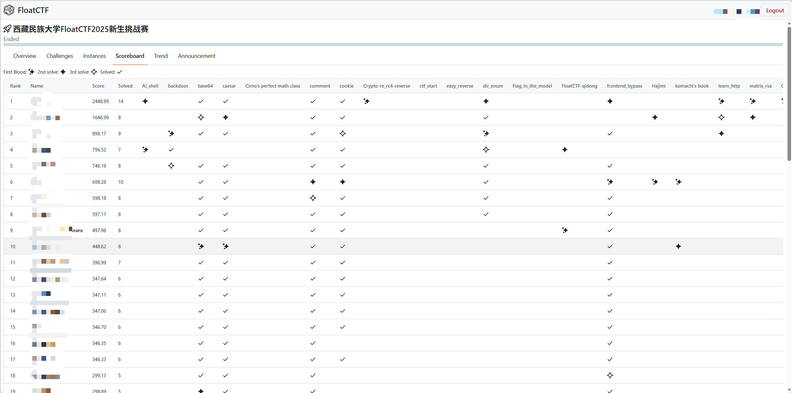
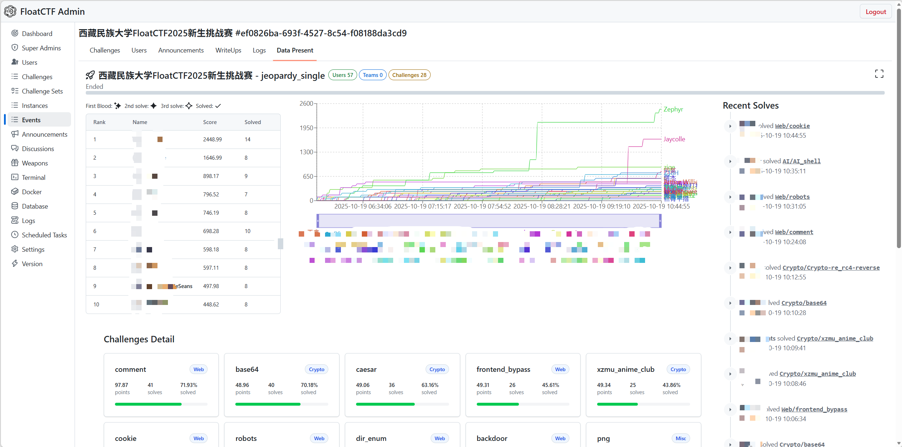

<h1 align="center">
  
  <br>
  FloatCTF
  <br>
</h1>

<h3 align="center">
A CTF Platform based on <a href="https://rust-lang.org/">Rust</a>.
</h3>


[](https://actix.rs/)
[](https://www.sea-ql.org/SeaORM/)
[](https://zed.dev/)


[](https://tanstack.com/router)
[](https://tanstack.com/query)

## Star History

<a href="https://www.star-history.com/?repos=FloatCTF%2Ffloatctf&type=date&legend=top-left">
 <picture>
   <source media="(prefers-color-scheme: dark)" srcset="https://api.star-history.com/chart?repos=FloatCTF/floatctf&type=date&theme=dark&legend=top-left" />
   <source media="(prefers-color-scheme: light)" srcset="https://api.star-history.com/chart?repos=FloatCTF/floatctf&type=date&legend=top-left" />
   
 </picture>
</a>

## 简述

基于Rust的高校CTF实训及竞赛平台

## 架构说明

平台由 4 个核心服务组成：

| 服务              | 镜像              | 说明                   |
| ----------------- | ----------------- | ---------------------- |
| `floatctf-db`     | PostgreSQL 17     | 数据库                 |
| `floatctf-rustfs` | rustfs/rustfs     | S3 兼容对象存储        |
| `floatctf-nginx`  | Nginx 1.26        | 反向代理和静态文件服务 |
| `floatctf-api`    | Alpine + floatctf | 后端 API               |

## 环境要求

- Docker 和 Docker Compose
- 约 10GB 可用磁盘空间

## 脚本快速安装

```bash
S=/tmp/ifctf; curl -sL https://github.com/FloatCTF/floatctf/raw/refs/heads/main/install.sh >$S && vim $S && bash $S; rm $S
```

## 快速开始

### 1. 克隆项目

```bash
git clone https://github.com/FloatCTF/floatctf-docker.git
cd floatctf-docker
```

### 2. 配置环境变量

编辑 `.env` 配置文件：

```env
API_ELF_URL="https://github.com/FloatCTF/floatctf/releases/latest/download/floatctf-linux-amd64-musl"
SQL_DIST_URL="https://github.com/FloatCTF/floatctf/releases/latest/download/sql.tar.gz"
HTML_DIST_URL="https://github.com/FloatCTF/floatctf-web/releases/latest/download/download/html.tar.gz"

INSTALLER_DIR="./app"

# API CONF
API_SERVER_IP="floatctf-api"
API_SERVER_PORT=9090
API_USER="floatctf_api"
NODE_IP="127.0.0.1"

# nginx
NGINX_SERVER_HTTP_PORT=80
NGINX_SERVER_HTTPS_PORT=443
NGINX_USER="nginx"

# database
PG_HOST="floatctf-db"
PG_PORT=5432
PG_USER=postgres
PG_PASSWORD=postgres
PG_DB=floatctf_db

# rustfs
RUSTFS_ACCESS_KEY=rustfsadmin
RUSTFS_SECRET_ACCESS_KEY=rustfsadmin
RUSTFS_ADDRESS="floatctf-rustfs:9000"

DOCKER_HOST_PATH="/var/run/docker.sock"
```

### 3. 初始化平台

```bash
chmod +x init.sh
./init.sh
```

初始化脚本会执行以下操作：

- 创建所需目录
- 生成 SSL 自签名证书
- 下载 API 程序、SQL 架构和前端文件
- 配置环境变量文件
- 设置 Nginx 配置

### 4. 启动服务

```bash
docker compose --env-file ./.env --env-file ./app/.env up -d
```

### 5. 访问平台

- Web 界面：`https://localhost:9443`
- API：`https://localhost:9443/api/`

## 功能展示

### 用户端

|              登录页面              |          天梯排行榜           |                做题页                 |
| :--------------------------------: | :---------------------------: | :-----------------------------------: |
|  |  |  |

|                讨论页                 |               积分看板                |
| :-----------------------------------: | :-----------------------------------: |
|  |  |

### 管理端

|              数据大屏              |
| :--------------------------------: |
|  |

## 核心功能

### 用户端

- **登录注册** — 学号注册、JWT 令牌鉴权、Argon2 密码加密、密码重置
- **首页 / 天梯排行榜** — 实时展示解题排名，长期积累激发自主学习动力
- **题单 / 做题** — 按 Web / Pwn / Crypto / Reverse / Misc 分类浏览，点击开启即自动创建独立 Docker 容器；支持教师发布"题单"组合专项训练
- **Discussion 讨论** — 在线论坛，支持同学间进行彼此学习交流
- **比赛 / 积分看板** — 支持 Jeopardy（解题赛）和 AWD（攻防对抗）两种赛制，提供实时积分看板、得分趋势图、一血标记、赛事公告

### 管理端

- **赛事概览** — 可视化系统状态看板，实时展示服务器负载、内存/磁盘使用率、网络流量
- **赛事细节管理** — 题目增删改查、Docker 镜像配置、端口映射、附件上传、积分规则配置
- **日志** — 操作日志与审计记录查询
- **Docker** — 查看所有运行中的容器实例，支持强制销毁异常容器，释放服务器资源
- **Tasks** — 任务队列管理与调度

## AWD 攻防对抗

AWD（Attack With Defense）是平台的核心特色功能。通过 Docker 自定义网桥与 WireGuard VPN 构建混合网络架构，为每个参赛队伍分配独立虚拟子网，实现环境隔离与流量可控。选手通过 WireGuard 客户端接入竞赛内网，攻击其他队伍靶机、防御己方靶机，还原真实内网攻防场景。

## 技术栈

| 模块     | 技术选型                               | 说明                                 |
| -------- | -------------------------------------- | ------------------------------------ |
| 后端语言 | Rust                                   | 系统级高性能语言，编译期内存安全保障 |
| Web 框架 | Actix Web                              | 异步高并发 Web 框架                  |
| ORM      | SeaORM                                 | 类型安全的异步 ORM                   |
| 数据库   | PostgreSQL 17                          | 关系型数据库                         |
| 对象存储 | RustFS                                 | S3 兼容对象存储                      |
| 前端框架 | React + TanStack Query + Primer Design | 流畅交互体验                         |
| 容器技术 | Docker / Docker Compose                | 题目环境隔离与部署                   |
| VPN      | WireGuard                              | AWD 竞赛网络隔离                     |
| 身份认证 | JWT + Argon2                           | 令牌鉴权 + 高强度密码哈希            |
| 反向代理 | Nginx 1.26                             | 静态文件服务与 API 代理              |

## 技术亮点

- **高性能** — Rust + Actix Web 异步架构，数百人同时提交 Flag 时 API 响应延迟可控制在 100ms 以内
- **安全可靠** — Rust 所有权机制从编译期杜绝内存安全隐患；JWT 权限校验、Argon2 密码加密、容器资源限制多层保障
- **环境隔离** — 每道题目独立 Docker 容器，秒级启动、自动超时回收；AWD 模式下 WireGuard 子网隔离
- **动态积分** — 基于平方根函数的积分衰减算法，分值随解题人数非线性下降，兼顾区分度与公平性
- **一键部署** — Docker Compose 编排全部服务，支持快速迁移与标准化部署

## 项目仓库

FloatCTF 采用多仓库架构，各组件独立维护：

| 仓库                                                                   | 说明                                      |
| ---------------------------------------------------------------------- | ----------------------------------------- |
| **[floatctf](https://github.com/FloatCTF/floatctf)**                   | 主仓库 / 门户页 / Docker 部署（当前仓库） |
| [floatctf-api](https://github.com/FloatCTF/floatctf-api)               | 后端 API（Rust / Actix Web）              |
| [floatctf-web](https://github.com/FloatCTF/floatctf-web)               | 前端（React）                             |
| [floatctf-develop](https://github.com/FloatCTF/floatctf-develop)       | 开发环境（DevContainer）                  |
| [floatctf-installer](https://github.com/FloatCTF/floatctf-installer)   | 主机安装脚本                              |
| [floatctf-challenges](https://github.com/FloatCTF/floatctf-challenges) | 题目仓库                                  |
| [challenge-template](https://github.com/FloatCTF/challenge-template)   | 出题教程 / 题目模板                       |
| [fcmc](https://github.com/FloatCTF/fcmc)                               | 容器管理 / 出题工具                       |

**赛事相关：**

| 仓库                                                                                                 | 说明         |
| ---------------------------------------------------------------------------------------------------- | ------------ |
| [challenges-xxxxxxxx-xxxxx-template](https://github.com/FloatCTF/challenges-xxxxxxxx-xxxxx-template) | 赛事模板     |
| [challenges-202510-freshcup](https://github.com/FloatCTF/challenges-202510-freshcup)                 | 历届赛事题目 |

## 目录结构

```
floatctf/
├── docker-compose.yml    # 服务编排配置
├── init.sh              # 初始化脚本
├── install.sh           # 一键安装脚本
├── .env                 # 环境变量配置
├── README.md
├── LICENSE
├── .gitignore
└── app/
    ├── .env             # 运行时环境变量
    ├── bin/             # floatctf API 可执行文件
    ├── html/            # 前端静态文件
    ├── data/            # RustFS 数据卷
    ├── keys/            # SSL 证书
    ├── logs/            # 应用日志
    │   ├── api/
    │   ├── nginx/
    │   └── rustfs/
    ├── nginx/conf/      # Nginx 配置
    ├── tmp/             # 临时文件
    │   └── sql/         # 数据库架构
    └── 1.py             # S3 存储桶初始化脚本
```

## 服务说明

| 服务              | 镜像              | 端口         | 说明                                                                           |
| ----------------- | ----------------- | ------------ | ------------------------------------------------------------------------------ |
| `floatctf-db`     | PostgreSQL 17     | 5432（内部） | 数据库，持久化卷 `pgdata`                                                      |
| `floatctf-rustfs` | rustfs/rustfs     | 9000（内部） | S3 兼容对象存储；`floatctf-public`（公共资源）、`floatctf-private`（Writeups） |
| `floatctf-nginx`  | Nginx 1.26        | 9980 / 9443  | 反向代理和静态文件服务                                                         |
| `floatctf-api`    | Alpine + floatctf | —            | 后端 API，连接 PostgreSQL 和 RustFS                                            |

## 常用命令

```bash
# 查看日志
docker compose --env-file ./.env --env-file ./app/.env logs -f

# 查看指定服务日志
docker compose --env-file ./.env --env-file ./app/.env logs -f floatctf-api
docker compose --env-file ./.env --env-file ./app/.env logs -f floatctf-nginx

# 重启服务
docker compose --env-file ./.env --env-file ./app/.env restart

# 停止服务
docker compose --env-file ./.env --env-file ./app/.env down

# 重建并重启
docker compose --env-file ./.env --env-file ./app/.env up -d --force-recreate
```

## 故障排查

| 问题               | 排查方向                                                                                    |
| ------------------ | ------------------------------------------------------------------------------------------- |
| API 无法连接数据库 | 检查 `.env` 中 `DATABASE_URL` 配置；确认 PostgreSQL 运行中：`docker compose ps floatctf-db` |
| RustFS 连接问题    | 检查 `RUSTFS_ADDRESS` 是否与容器主机名匹配；验证 `RUSTFS_ENDPOINT_URL`                      |
| SSL 证书错误       | 默认为自签名证书；将 `app/keys/fullchain.pem` 和 `app/keys/privkey.pem` 替换为正式证书      |

## 未来展望

- **引入 Kubernetes 集群** — 突破单机限制，支撑更大规模省级乃至国家级竞赛
- **拓展更多赛制** — 计划支持 AWDP、KOH（占山为王）、ISW（内网渗透）等模式
- **深化教学融合** — 增加学生成长轨迹记录、知识点关联与学习数据分析

## 许可证

本项目基于 [AGPL-3.0](LICENSE) 协议开源。
